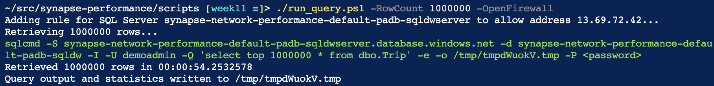

# Testing Synapse Analytics Network Performance

This repo can be used to demonstrate performance of connectivity between AWS & Azure regions. The workload used in this demo is Synapse Analytics (formerly known as SQL Data Warehouse)  populated with the [New York Taxicab dataset](https://docs.microsoft.com/en-us/azure/synapse-analytics/sql-data-warehouse/load-data-from-azure-blob-storage-using-copy).
For connectivity Site-to-Site VPN ([aws-azure-vpn](/terraform/modules/aws-azure-vpn) module) is used, which implements the AWS - Azure S2S VPN described in this [excellent blog post](https://deployeveryday.com/2020/04/13/vpn-aws-azure-terraform.html) by [Jonatas Baldin](https://deployeveryday.com/about.html).

<br/>

## Pre-requisites
- To get started you need [Git](https://git-scm.com/), [Terraform](https://www.terraform.io/downloads.html) (to get that I use [tfenv](https://github.com/tfutils/tfenv) on Linux & macOS, [Homebrew](https://github.com/hashicorp/homebrew-tap) on macOS or [chocolatey](https://chocolatey.org/packages/terraform) on Windows)
- A SSH public key (default location is ~/.ssh/id_rsa.pub). If you choose to provision AWS resourcses (see below), this key is also used to create secrets for EC2 instances, [which requires](https://docs.aws.amazon.com/AWSEC2/latest/WindowsGuide/ec2-key-pairs.html) the private key to be in PEM format
- There are some scripts to make life easier, you'll need [PowerShell](https://github.com/PowerShell/PowerShell#get-powershell) to execute those    

If you create a GitHub [Codespace](https://github.com/features/codespaces) for this repository, you'll get the above set up - including a generated SSH key pair.

You need a Azure subscription. The identity used needs to have the subscription contributor role in order to create resource groups.   
Authenticate using [Azure CLI](https://www.terraform.io/docs/providers/azurerm/guides/azure_cli.html):
```
az login
```

or use a [Service Principal](https://www.terraform.io/docs/providers/azurerm/guides/service_principal_client_secret.html):
```
ARM_CLIENT_ID="00000000-0000-0000-0000-000000000000"
ARM_CLIENT_SECRET="00000000-0000-0000-0000-000000000000"
```

Make sure you work with the right subscription:

```
ARM_SUBSCRIPTION_ID="00000000-0000-0000-0000-000000000000"        

```

A SSH public key (default location is ~/.ssh/id_rsa.pub) is required. This key is also used to create secrets for EC2 instances, [which requires](https://docs.aws.amazon.com/AWSEC2/latest/WindowsGuide/ec2-key-pairs.html) the private key to be in PEM format. Create a key pair if you don't have one set up:
```
ssh-keygen -m PEM -f ~/.ssh/id_rsa
```

You can then provision resources by first initializing Terraform:   
```
terraform init
```  

And then running:  
```
terraform apply
```
Take note of configuration data generated by Terraform.

To populate Synapse Analytics, run this script:
```
./scripts/load_data.ps1
```
If the script fails, you can run it multiple times - it will only load tables not populated yet.
Alternatively, follow the manual steps [documented here](https://docs.microsoft.com/en-us/azure/synapse-analytics/sql-data-warehouse/load-data-from-azure-blob-storage-using-copy).


## Test scenarios

### From Azure VM
Now you can log on the the AWS VM. The username is `Administrator`. Use configuration data from Terraform to get the password and public IP address:
```
terraform output aws_windows_vm_password
terraform output aws_windows_vm_public_ip_address
```
You can also use the generated file at data/default/azure-client.rdp.   
Connect to Synapse Analytics using SQL Server Management Studio. The Synapse Analytics password and FQDN can be fetched using:
```
terraform output user_password
terraform output azure_sql_dwh_fqdn
```
The VM should already have SQL Server Management Studio installed, and the Virtual Network is configured to use the Private Endpoint of Synapse Analytics. Within SQL Server Management Studio, run a query e.g.
```
select top 100000000 * from dbo.Trip
```
This query simulates an ETL of 100M rows and completes in ~ 30 minutes, when executed from AWS Ireland to Synapse Analytics with DW100c in Azure West Europe (Amsterdam). Using the public endpoint instead of S2S VPN and private endpoint yields the same results, both paths are taking a direct route.  


### From AWS VM
In that case you need an AWS account. There are [multiple ways](https://registry.terraform.io/providers/hashicorp/aws/latest/docs) to configure the AWS Terraform provider, I tested with static credentials:
```
AWS_ACCESS_KEY_ID="AAAAAAAAAAAAAAAAAAAA"
AWS_DEFAULT_REGION="eu-west-1"
AWS_SECRET_ACCESS_KEY="xxxxxxxxxxxxxxxxxxxxxxxxxxxxxxxxxxxxxxxx"
```
    

The approach is simular to using the Azure VM. Instead of DNS, in this scenario automation has the hosts file edited to append a line to resolve Synapse Analytics to the Private Endpoint in the Azure Virtual Network. This will than connect over the Site-to-Site VPN created.

### From Azure Cloud Shell
In this scenario, you can run the [run_query.ps1](scripts/run_query.ps1) script that uses the [sqlcmd](https://docs.microsoft.com/en-us/sql/tools/sqlcmd-utility?view=azure-sqldw-latest) tool to execute a query against Synapse Analytics.

If you provisioned Terraform from the same directory, or have a backend set up, there are no mandatory arguments. Otherwise type `run_query.ps1 -?` to gat the list of arguments:   
    

Cloud Shell can be configured to access Synapse over a virtual network. This requires you to create a new Cloud Shell, as described [here](https://docs.microsoft.com/en-us/azure/cloud-shell/private-vnet#configuring-cloud-shell-to-use-a-virtual-network). If not, specify the `-OpenFirewall` argument. Assuming you have the permission to do so, it will create an allow rule for the public IP address you're currently connecting from.

Instead of wriring the result to the terminal (which would dramatically slow down performance at best, and worst case not work at all), downloaded records are saved to a temporary file.


You can of course run this locally as well.

### Scheduled Azure Function
For intermittent performance issue's, it is valuable to meassure query times on a regular schedule and capture the results. This repo includes an Azure function named [GetRows](functions/GetRows.cs) with a timer trigger. This function retrieves data from Synapase, and then discards it:
```
using (SqlDataReader reader = cmd.EndExecuteReader(result))
{
    while (reader.Read())
    {
        rowsRetrieved++;

        // Read all fields
        for (int i = 0; i < reader.FieldCount; i++)
        {
            reader.GetValue(i);
        }
    }
}
```

In addition to the function, Terraform also provisions Application Insights, and an alert rule with action group. This is an example alert email message:
   

This alert is defined by a Kusto query:
```
requests
| join (traces) on operation_Id
| where message == "RunResult"
| project timestamp, operation_Name, success, resultCode, duration, rows_requested=customDimensions1['RowsRequested'], rows_retrieved=customDimensions1['RowsRetrieved'], cloud_RoleName
| where timestamp > ago(30d)
| where cloud_RoleName contains_cs 'synapse' and operation_Name =~ 'GetRows' and duration > 40000
| order by timestamp desc
```

And yields a reult similar to the below data:
   

## Clean up
When you want to destroy resources, run:   
```
terraform destroy
```