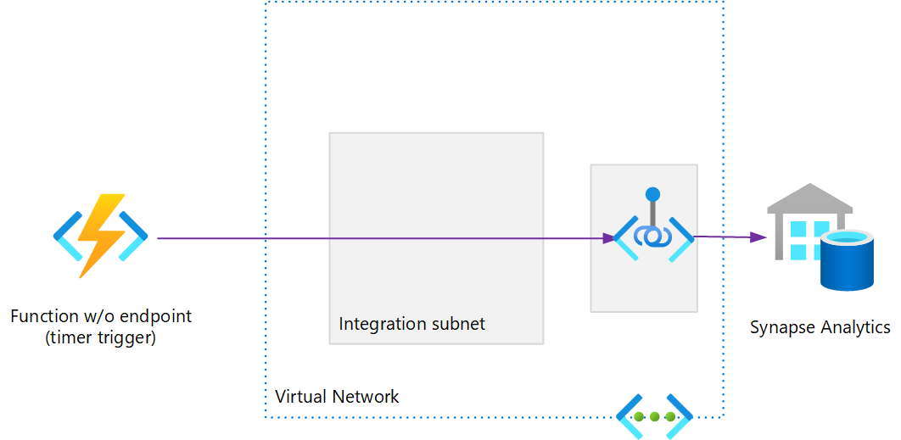
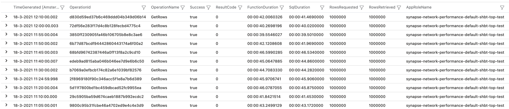

# Testing Synapse Analytics Network Performance

This repo can be used to demonstrate performance of connectivity between various clients and Synapse in Azure. Queries are executed from these clients to simulate 'real world' performance experienced by users.
Synapse Analytics (formerly known as SQL Data Warehouse) is populated with the [New York Taxicab dataset](https://docs.microsoft.com/en-us/azure/synapse-analytics/sql-data-warehouse/load-data-from-azure-blob-storage-using-copy).


<br/>

## Pre-requisites
- To get started you need [Git](https://git-scm.com/), [Terraform](https://www.terraform.io/downloads.html) (to get that I use [tfenv](https://github.com/tfutils/tfenv) on Linux & macOS, [Homebrew](https://github.com/hashicorp/homebrew-tap) on macOS or [chocolatey](https://chocolatey.org/packages/terraform) on Windows)
- A SSH public key (default location is ~/.ssh/id_rsa.pub). If you choose to provision AWS resourcses (see below), this key is also used to create secrets for EC2 instances, [which requires](https://docs.aws.amazon.com/AWSEC2/latest/WindowsGuide/ec2-key-pairs.html) the private key to be in PEM format
- To build & deploy the Azure Function, you'll need the [.NET 3.1 SDK](https://dotnet.microsoft.com/download/dotnet/3.1) and the [Azure Function Tools](https://www.npmjs.com/package/azure-functions-core-tools)
- There are some scripts to make life easier, you'll need [PowerShell](https://github.com/PowerShell/PowerShell#get-powershell) to execute those    

If you create a GitHub [Codespace](https://github.com/features/codespaces) for this repository, you'll get the above set up - including a generated SSH key pair.

You need an Azure subscription. The identity used needs to have the subscription contributor role in order to create resource groups.   
Authenticate using [Azure CLI](https://www.terraform.io/docs/providers/azurerm/guides/azure_cli.html):
```
az login
```

or use a [Service Principal](https://www.terraform.io/docs/providers/azurerm/guides/service_principal_client_secret.html):
```
ARM_CLIENT_ID="00000000-0000-0000-0000-000000000000"
ARM_CLIENT_SECRET="00000000-0000-0000-0000-000000000000"
```

Make sure you work with the right subscription:

```
ARM_SUBSCRIPTION_ID="00000000-0000-0000-0000-000000000000"        

```

A SSH public key (default location is ~/.ssh/id_rsa.pub) is required. This key is also used to create secrets for EC2 instances (if you follow that path), [which requires](https://docs.aws.amazon.com/AWSEC2/latest/WindowsGuide/ec2-key-pairs.html) the private key to be in PEM format. Create a key pair if you don't have one set up:
```
ssh-keygen -m PEM -f ~/.ssh/id_rsa
```

You can then provision resources by first initializing Terraform:   
```
terraform init
```  

And then running:  
```
terraform apply
```
Take note of configuration data generated by Terraform.

To populate Synapse Analytics, run this script:
```
./scripts/load_data.ps1
```
If the script fails, you can re-run it multiple times - it will only load tables not populated yet.
Alternatively, follow the manual steps [documented here](https://docs.microsoft.com/en-us/azure/synapse-analytics/sql-data-warehouse/load-data-from-azure-blob-storage-using-copy).


## Test scenarios
The infrastructure provisioned can support various test scenarios, and therefore is configurable using Terraform input variables. See sample [config.auto.tfvars](./terraform/config.auto.tfvars.example) for potential variables to override. Each of the below scenario's will need specific switches enabled. The file [variables.tf](./terraform/variables.tf) lists all input variables.


### From Azure VM
Terraform input variable`deploy_azure_client` should be set to `true` when provisioning infrastructure. Once provisioned, you can log on the the Azure VM. The username is `demoadmin`. Use configuration data from Terraform to get the password and public IP address:
```
terraform output user_name
terraform output user_password
terraform output azure_windows_vm_public_ip_address
```
You can also use the generated file at data/default/azure-client.rdp.   
Connect to Synapse Analytics using SQL Server Management Studio. The Synapse Analytics credentials are the same as for the VM. The FQDN can be fetched using:
```
terraform output azure_sql_dwh_fqdn
```
The VM will already have SQL Server Management Studio installed, and the Virtual Network is configured to use the Private Endpoint of Synapse Analytics. Within SQL Server Management Studio, run a query e.g.
```
select top 100000000 * from dbo.Trip
```
This query simulates an ETL of 100M rows and completes in ~ 30 minutes, when executed from AWS Ireland to Synapse Analytics with DW100c in Azure West Europe (Amsterdam). Using the public endpoint instead of S2S VPN and private endpoint yields the same results, both paths are taking a direct route.  

<p align="center">

</p>

### From AWS VM
Terraform input variable`deploy_aws_client` should be set to `true` when provisioning infrastructure.
You will need an AWS account. There are [multiple ways](https://registry.terraform.io/providers/hashicorp/aws/latest/docs) to configure the AWS Terraform provider, I tested with static credentials:
```
AWS_ACCESS_KEY_ID="AAAAAAAAAAAAAAAAAAAA"
AWS_DEFAULT_REGION="eu-west-1"
AWS_SECRET_ACCESS_KEY="xxxxxxxxxxxxxxxxxxxxxxxxxxxxxxxxxxxxxxxx"
```
For connectivity Site-to-Site VPN ([aws-azure-vpn](/terraform/modules/aws-azure-vpn) module) is used, which implements the AWS - Azure S2S VPN described in this [excellent blog post](https://deployeveryday.com/2020/04/13/vpn-aws-azure-terraform.html) by [Jonatas Baldin](https://deployeveryday.com/about.html).
    

The approach is simular to using the Azure VM, these output variables are relevant to set up a RDP connection:
```
terraform output aws_windows_vm_password
terraform output aws_windows_vm_public_ip_address
```
Instead of DNS, in this scenario [automation](https://docs.aws.amazon.com/AWSEC2/latest/WindowsGuide/ec2-windows-user-data.html) has the hosts file edited to append a line to resolve Synapse Analytics to the Private Endpoint in the Azure Virtual Network. This will than connect over the Site-to-Site VPN created.

### From Azure Cloud Shell
In this scenario, you can run the [run_query.ps1](scripts/run_query.ps1) script that uses the [sqlcmd](https://docs.microsoft.com/en-us/sql/tools/sqlcmd-utility?view=azure-sqldw-latest) tool to execute a query against Synapse Analytics.

If you provisioned Terraform from the same directory, or have a backend set up, there are no mandatory arguments. Otherwise type `run_query.ps1 -?` to gat the list of arguments:   
    

Cloud Shell can be configured to access Synapse over a virtual network. This requires you to create a new Cloud Shell, as described [here](https://docs.microsoft.com/en-us/azure/cloud-shell/private-vnet#configuring-cloud-shell-to-use-a-virtual-network). If not, specify the `-OpenFirewall` argument. Assuming you have the permission to do so, it will create an allow rule for the public IP address you're currently connecting from.

Instead of wriring the result to the terminal (which would dramatically slow down performance at best, and worst case not work at all), downloaded records are saved to a temporary file.


You can of course run this anywhere you like, provided you have PowerShell and sqlcmd installed.

### Timer Azure Function
For intermittent performance issue's, it is valuable to measure query times on a regular schedule and capture the results. 
<p align="center"></p>

This repo includes an Azure function named [GetRows](functions/GetRows.cs) with a timer trigger (i.e. no HTTP endpoint) and uses [Virtual Network Integration](https://docs.microsoft.com/en-us/azure/azure-functions/functions-networking-options#virtual-network-integration) to connect to the Synapse Analytics Private Endpoint.
Terraform input variable `deploy_serverless` should be set to `true` when provisioning infrastructure. After provisioning, either run `deploy_function.ps1` or use the function tools to publish the Azure Function:     

<p align="center"></p>
 
This function retrieves all requested rows from Synapase Analytics, and then discards them:
```
using (SqlDataReader reader = cmd.EndExecuteReader(result))
{
    while (reader.Read())
    {
        rowsRetrieved++;

        // Read all fields
        for (int i = 0; i < reader.FieldCount; i++)
        {
            reader.GetValue(i);
        }
    }
}
```

In addition to the function, Terraform also provisions Application Insights, and an alert rule with action group. This is an example alert email message:
   

This alert is defined by a Kusto query:
```
AppRequests
| join (AppTraces
    | where Message == "RunResult"
    | project OperationId, RowsRequested=Properties['RowsRequested'], RowsRetrieved=Properties['RowsRetrieved']) on OperationId
| project TimeGenerated, OperationId, OperationName, Success, ResultCode, DurationMs, RowsRequested, RowsRetrieved, AppRoleName
| where TimeGenerated > ago(30d)
| where AppRoleName contains_cs 'synapse' and OperationName =~ 'GetRows' and DurationMs > 40000
| order by TimeGenerated desc
```

And yields a result similar to the below data:
   

## Clean up
When you want to destroy resources, run:   
```
terraform destroy
```
