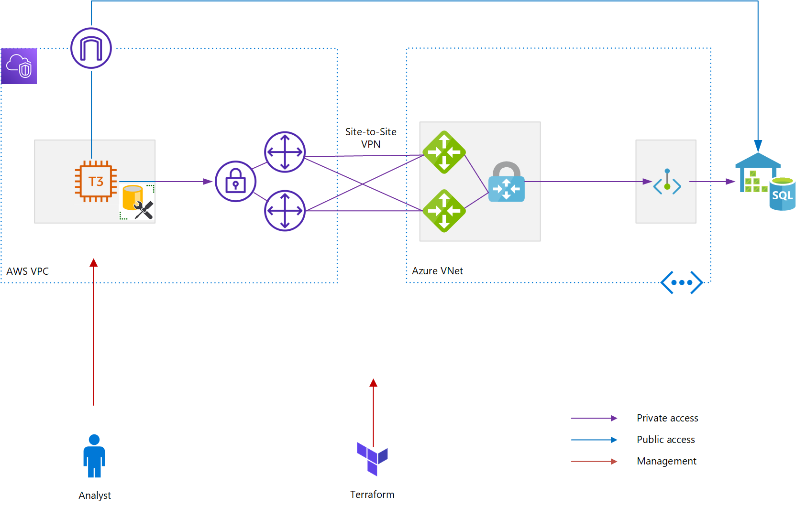

# AWS-Azure Site-to-Site VPN with Synapse Analytics

This repo can be used to demonstrate performance of connectivity between AWS & Azure regions. The workload used in this demo is Synapse Analytics (formerly SQL Data Warehouse)  populated with the [New York Taxicab dataset](https://docs.microsoft.com/en-us/azure/synapse-analytics/sql-data-warehouse/load-data-from-azure-blob-storage-using-copy).
For connectivity Site-to-Site VPN ([aws-azure-vpn](/terraform/modules/aws-azure-vpn) module) is used, which implements the AWS - Azure S2S VPN described in this [excellent blog post](https://deployeveryday.com/2020/04/13/vpn-aws-azure-terraform.html) by [Jonatas Baldin](https://deployeveryday.com/about.html).

<br/>



## Pre-requisites
- To get started you need [Git](https://git-scm.com/), [Terraform](https://www.terraform.io/downloads.html) (to get that I use [tfenv](https://github.com/tfutils/tfenv) on Linux & macOS, [Homebrew](https://github.com/hashicorp/homebrew-tap) on macOS or [chocolatey](https://chocolatey.org/packages/terraform) on Windows)
- A SSH public key (default location is ~/.ssh/id_rsa.pub). This key is also used to create secrets for EC2 instances, [which requires](https://docs.aws.amazon.com/AWSEC2/latest/WindowsGuide/ec2-key-pairs.html) the private key to be in PEM format
- There are some scripts to make life easier, you'll need [PowerShell](https://github.com/PowerShell/PowerShell#get-powershell) to execute those    

If you create a GitHub Codespace for this repository, you'll get the above set up - including a generated SSH key pair.

### AWS
You need an AWS account. There are [multiple ways](https://registry.terraform.io/providers/hashicorp/aws/latest/docs) to configure the AWS Terraform provider, I tested with static credentials:
```
AWS_ACCESS_KEY_ID="AAAAAAAAAAAAAAAAAAAA"
AWS_DEFAULT_REGION="eu-west-1"
AWS_SECRET_ACCESS_KEY="xxxxxxxxxxxxxxxxxxxxxxxxxxxxxxxxxxxxxxxx"
```


### Azure
You need a Azure subscription. The identity used needs to have the subscription contributor role in order to create resource groups.   
Authenticate using [Azure CLI](https://www.terraform.io/docs/providers/azurerm/guides/azure_cli.html):
```
az login
```

or use a [Service Principal](https://www.terraform.io/docs/providers/azurerm/guides/service_principal_client_secret.html):
```
ARM_CLIENT_ID="00000000-0000-0000-0000-000000000000"
ARM_CLIENT_SECRET="00000000-0000-0000-0000-000000000000"
```

Make sure you work with the right subscription:

```
ARM_SUBSCRIPTION_ID="00000000-0000-0000-0000-000000000000"        

```

A SSH public key (default location is ~/.ssh/id_rsa.pub) is required. This key is also used to create secrets for EC2 instances, [which requires](https://docs.aws.amazon.com/AWSEC2/latest/WindowsGuide/ec2-key-pairs.html) the private key to be in PEM format. Create a key pair if you don't have one set up:
```
ssh-keygen -m PEM -f ~/.ssh/id_rsa
```

You can then provision resources by first initializing Terraform:   
```
terraform init
```  

And then running:  
```
terraform apply
```
Take note of configuration data generated by Terraform.

To populate Synapse Analytics, run this script:
```
./scripts/load_data.ps1
```
If the script fails, you can run it multiple times - it will only load tables not populated yet.
Alternatively, follow the manual steps [documented here](https://docs.microsoft.com/en-us/azure/synapse-analytics/sql-data-warehouse/load-data-from-azure-blob-storage-using-copy).

Now you can log on the the AWS VM. The username is `Administrator`. Use configuration data from Terraform to get the password and public IP address:
```
terraform output aws_windows_vm_password
terraform output aws_windows_vm_public_ip_address
```
Connect to Synapse Analytics using SQL Server Management Studio. The Synapse Analytics password and FQDN can be fetched using:
```
terraform output user_password
terraform output azure_sql_dwh_fqdn
```
The VM should already have SQL Server Management Studio installed, and the hosts file edited with a line to resolve Synapse Analytics to the Private Endpoint in the Azure Virtual Network. Within SQL Server Management Studio, run a query e.g.

```
select top 100000000 * from dbo.Trip
```
This query simulates an ETL of 100M rows and completes in ~ 30 minutes, when executed from AWS Ireland to Synapse Analytics with DW100c in Azure West Europe (Amsterdam). Using the public endpoint instead of S2S VPN and private endpoint yields the same results.  


When you want to destroy resources, run:   
```
terraform destroy
```